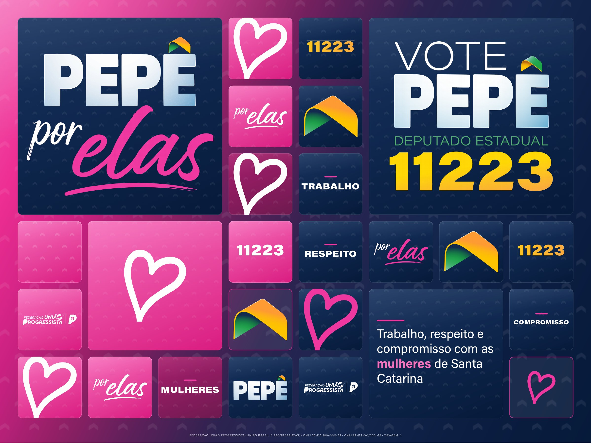

# Backdrop "Pepê por Elas" — 300 × 225 cm

Painel de fotos do evento **Pepê por Elas**. É um backdrop de patrocinador:
mosaico de caixinhas, cada uma com um elemento da campanha, para que qualquer
recorte da foto continue assinado mesmo com gente na frente.



## O que tem nesta pasta

| Arquivo | Para quê |
|---|---|
| `Backdrop Pepe por Elas 300x225cm (1-10).pdf` | **É este que vai para a gráfica.** 300 × 225 mm, escala 1:10 |
| `Backdrop Pepe por Elas 300x225cm (autossuficiente).html` | Cópia que anda sozinha — WhatsApp, e-mail, computador da gráfica |
| `backdrop.html` | Arquivo de trabalho. É aqui que se mexe |
| `assets/` | Marcas, coração, seta, textura e as fontes que o HTML lê |
| `bin/empacotar.py` | Gera a cópia autossuficiente a partir do `backdrop.html` |
| `preview-backdrop-por-elas.png` / `.jpg` | Prévia achatada, 2400 px |

## Medida e escala

A peça é **300 × 225 cm** (4:3), a mesma proporção do `banner-300x225cm.psd`
que veio junto do pedido. O HTML trabalha em **1 cm real = 8 px de tela**, então
a peça mede 2400 × 1800 px no navegador. Na impressão o CSS reduz para
**300 × 225 mm**, ou seja **1:10** — a gráfica amplia 10×.

Confira com a régua do Acrobat: no PDF, 1 mm = 1 cm de lona.

**Deixe 5 cm de sobra em cada lado** para a bainha/estrutura. O `backdrop.html`
tem um botão **guias** no rodapé da tela que desenha essa área segura e mais a
faixa dos rostos (150–190 cm do chão) — a faixa onde ninguém deve apostar
informação, porque é justamente onde a cabeça das pessoas fica na foto. As guias
não saem na impressão.

## Regerar o PDF

Abra `backdrop.html` no Chrome e mande imprimir:

- Destino: **Salvar como PDF**
- Tamanho: **300 × 225 mm** (o `@page` do arquivo já pede isso; em papel
  personalizado use 300 × 225 mm)
- Margens: **nenhuma**
- Marque **Gráficos de plano de fundo**
- Escala: **100 %** (não deixe em "ajustar à página")

Pela linha de comando dá no mesmo:

```bash
cd "BACKDROP POR ELAS"
"/Applications/Google Chrome.app/Contents/MacOS/Google Chrome" \
  --headless --disable-gpu --allow-file-access-from-files --no-pdf-header-footer \
  --virtual-time-budget=8000 \
  --print-to-pdf="Backdrop Pepe por Elas 300x225cm (1-10).pdf" \
  "file://$PWD/backdrop.html"
```

E depois, para atualizar a cópia de mão:

```bash
python3 bin/empacotar.py
```

## Como remontar o painel

A grade é de **8 colunas × 6 linhas**. Quatro blocos têm posição fixa no CSS:

| Bloco | Onde |
|---|---|
| Marca do evento (PEPÊ + por elas) | colunas 1–3, linhas 1–3 |
| VOTE PEPÊ 11223 | colunas 6–8, linhas 1–3 |
| Coração grande | colunas 2–3, linhas 4–5 |
| Frase da campanha | colunas 6–7, linhas 5–6 |

As outras 22 caixinhas entram por fluxo automático e preenchem as células
livres **na ordem em que aparecem no HTML**. Trocar a ordem delas remonta o
painel; trocar a classe (`rosa`, `navy`, `vinho`, `vidro`) troca o fundo da
caixa. O rosa está puxado para a esquerda e para baixo e o azul para a direita,
acompanhando a diagonal do fundo — se for mexer, mantenha essa diagonal.

Para colocar data e cidade do evento, o lugar natural é a caixinha `vinho` que
hoje diz **MULHERES** (linha 6, coluna 3): ela é a única de texto livre que não
carrega mensagem obrigatória.

## De onde vieram as cores e os desenhos

O rosa **`#F039A1`** não foi escolhido de olho: foi lido do degradê vetorial de
dentro do PDF `Pepe-bolao POR ELAS40x40-modelo3_2026_ sozinho v2 18-08.pdf`,
antes de qualquer conversão CMYK. É o mesmo rosa do bolão que já está impresso.

Os azuis, o amarelo do número, a seta, a textura de fundo e as fontes são os da
identidade oficial — `_IDENTIDADE/CLAUDE.md` manda, e nada aqui contraria.

Três desenhos foram extraídos do PDF do bolão em 900 dpi, com o fundo recortado:

- `assets/por-elas.png` — o lettering "por elas" com o risco embaixo
- `assets/por-elas-branco.png` — o mesmo, todo branco, para caixinha rosa
- `assets/coracao-rosa.png` / `coracao-branco.png` — o coração à mão
- `assets/pepe.png` — a palavra PEPÊ com degradê; o acento é a seta oficial da
  identidade, recolocada por cima (o acento original ficava sobre a faixa rosa
  e não saía limpo no recorte)
- `assets/federacao.png` — a assinatura da Federação, em branco

`vote-11223.png` veio do original vetorial da agência (`_ARTE /`), não do PDF.

## Impressão

- O PDF é RGB. **Lona é CMYK**: peça prova de cor à gráfica antes da tiragem, e
  olhe principalmente o amarelo `#FFC400` do número, que é o tom que mais anda
  na conversão.
- Material: lona fosca. Backdrop de foto com lona brilhante estoura no flash.
- A resolução efetiva das imagens no tamanho final fica entre 70 e 90 dpi, que é
  o padrão de grande formato para peça vista a mais de um metro.

## Rodapé legal

A linha do rodapé traz CNPJ da Federação e das duas legendas e o campo
**Tiragem**, hoje em `1`. Se o gabinete mandar imprimir mais de uma unidade,
corrija o número no `backdrop.html` (procure por `TIRAGEM`) e regere o PDF.
